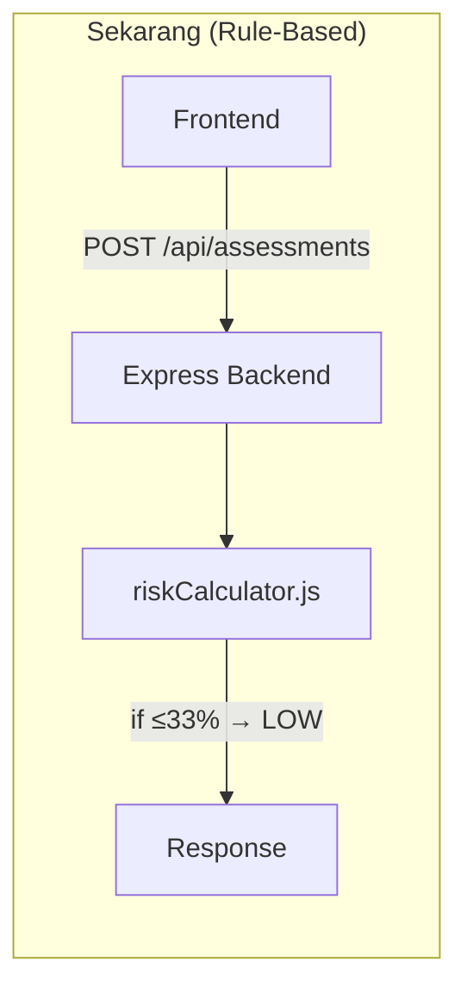
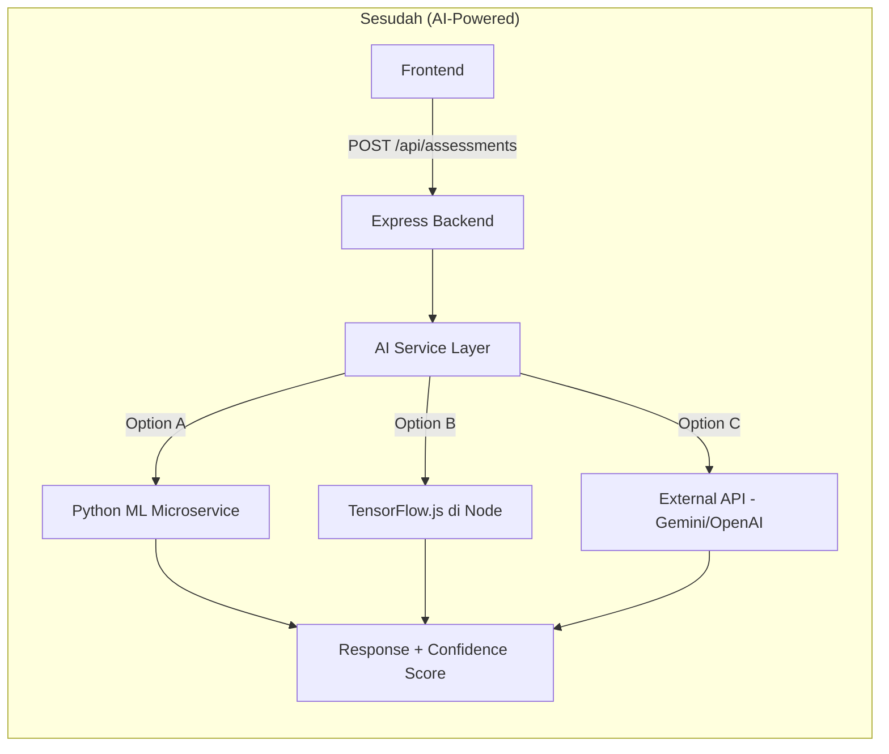

# Rencana Integrasi Model AI — GastroCare

## Gambaran Umum

Mengganti/melengkapi logika `riskCalculator.js` (yang saat ini menggunakan rule-based scoring) dengan model AI/ML untuk prediksi risiko GERD yang lebih akurat.

---

## Arsitektur Saat Ini vs Sesudah





---

## Tahap 1 — Persiapan Data & Analisis

### 1.1 Kumpulkan Dataset

Sebelum melatih model, kamu butuh data. Ada beberapa opsi:

| Sumber | Keterangan |
|--------|-----------|
| **Data aplikasi sendiri** | Kumpulkan dari tabel `assessments` yang sudah ada. Butuh minimal ~500-1000 record untuk model sederhana |
| **Dataset medis publik** | Cari dataset GERD di [Kaggle](https://kaggle.com), [UCI ML Repository](https://archive.ics.uci.edu), atau jurnal medis |
| **Synthetic data** | Generate data sintetis berdasarkan pola medis yang sudah diketahui (untuk prototyping) |

### 1.2 Tentukan Fitur (Features)

Saat ini hanya ada 5 pertanyaan (skor 0-5). Untuk model AI yang lebih akurat, pertimbangkan menambah fitur:

```
Fitur yang sudah ada:
├── heartburn_frequency (0-5)
├── acid_regurgitation (0-5)
├── difficulty_swallowing (0-5)
├── chest_pain (0-5)
└── symptom_worsening (0-5)

Fitur tambahan (opsional):
├── age
├── gender
├── bmi
├── smoking_status
├── alcohol_consumption
├── medication_history
└── family_history
```

### 1.3 Tentukan Output Model

| Pendekatan | Output | Kelebihan |
|-----------|--------|-----------|
| **Klasifikasi** | LOW / MODERATE / HIGH | Sederhana, sama seperti sekarang |
| **Regresi** | Skor kontinu 0-100 | Lebih granular |
| **Probabilistik** | `{ low: 0.15, moderate: 0.60, high: 0.25 }` | Paling informatif, bisa tampilkan confidence |

> [!TIP]
> **Rekomendasi:** Gunakan pendekatan probabilistik — tampilkan confidence score di UI agar user tahu seberapa yakin model terhadap hasilnya.

---

## Tahap 2 — Pilih Pendekatan AI

### Opsi A: Python ML Microservice (Rekomendasi)

Paling fleksibel — gunakan scikit-learn, TensorFlow, atau PyTorch.

```
backend/          ← Express (tetap)
ai-service/       ← BARU: Python FastAPI
├── app.py
├── model/
│   ├── train.py
│   ├── gerd_model.pkl    ← model yang sudah dilatih
│   └── preprocessor.pkl
├── requirements.txt
└── Dockerfile
```

**Alur:**
```
Express → HTTP call ke localhost:8000/predict → Python memproses → return prediction
```

**Pro:** Full ML ecosystem (pandas, sklearn, etc.), model training terpisah
**Kontra:** Perlu maintain 2 service, latency tambahan ~50-100ms

### Opsi B: TensorFlow.js di Node.js

Jalankan model langsung di Express tanpa service tambahan.

```
backend/
├── src/
│   └── services/
│       ├── riskCalculator.js      ← fallback rule-based
│       └── aiPredictor.js         ← BARU: TF.js inference
├── models/
│   └── gerd_model/
│       ├── model.json
│       └── weights.bin
```

**Pro:** Satu service, tidak ada network overhead
**Kontra:** Ecosystem ML di JS lebih terbatas, training tetap perlu Python

### Opsi C: External AI API (Gemini / OpenAI)

Kirim data ke LLM API untuk analisis.

```js
// Contoh: kirim jawaban + konteks medis ke Gemini
const prompt = `
  Analisis risiko GERD berdasarkan jawaban berikut: ${JSON.stringify(answers)}
  Berikan: riskLevel, confidence, recommendation, reasoning
`
```

**Pro:** Tidak perlu training, reasoning yang kaya
**Kontra:** Biaya per-request, latency tinggi, kurang deterministic

---

## Tahap 3 — Implementasi (Opsi A: Python Microservice)

### 3.1 Setup Python Service

```bash
mkdir ai-service
cd ai-service
python -m venv venv
pip install fastapi uvicorn scikit-learn pandas joblib
```

### 3.2 Train Model Sederhana

```python
# ai-service/model/train.py
import pandas as pd
from sklearn.ensemble import RandomForestClassifier
from sklearn.model_selection import train_test_split
import joblib

# Load data (dari CSV atau query database)
data = pd.read_csv('gerd_dataset.csv')

features = ['heartburn', 'regurgitation', 'dysphagia', 'chest_pain', 'postural']
X = data[features]
y = data['risk_level']  # LOW=0, MODERATE=1, HIGH=2

X_train, X_test, y_train, y_test = train_test_split(X, y, test_size=0.2)

model = RandomForestClassifier(n_estimators=100)
model.fit(X_train, y_train)

print(f"Accuracy: {model.score(X_test, y_test):.2f}")

joblib.dump(model, 'gerd_model.pkl')
```

### 3.3 Buat Prediction API

```python
# ai-service/app.py
from fastapi import FastAPI
from pydantic import BaseModel
import joblib
import numpy as np

app = FastAPI()
model = joblib.load('model/gerd_model.pkl')

class PredictionRequest(BaseModel):
    answers: list[int]  # [3, 2, 1, 0, 4]

class PredictionResponse(BaseModel):
    riskLevel: str
    confidence: float
    probabilities: dict

@app.post("/predict", response_model=PredictionResponse)
def predict(req: PredictionRequest):
    X = np.array(req.answers).reshape(1, -1)
    proba = model.predict_proba(X)[0]
    pred = model.predict(X)[0]

    labels = ['LOW', 'MODERATE', 'HIGH']
    return PredictionResponse(
        riskLevel=labels[pred],
        confidence=float(max(proba)),
        probabilities={labels[i]: float(proba[i]) for i in range(3)}
    )
```

### 3.4 Integrasikan ke Express Backend

```
Buat file baru: src/services/aiPredictor.js
```

```js
// src/services/aiPredictor.js
const AI_SERVICE_URL = process.env.AI_SERVICE_URL || 'http://localhost:8000'

async function predictWithAI(answers) {
  const scores = answers.map(a => a.score)

  const response = await fetch(`${AI_SERVICE_URL}/predict`, {
    method: 'POST',
    headers: { 'Content-Type': 'application/json' },
    body: JSON.stringify({ answers: scores }),
  })

  if (!response.ok) {
    throw new Error('AI service unavailable')
  }

  return response.json()
}

module.exports = { predictWithAI }
```

### 3.5 Update Assessment Controller

```js
// Di assessmentController.js — tambahkan hybrid logic
const { calculateRisk } = require('../services/riskCalculator')
const { predictWithAI } = require('../services/aiPredictor')

async function submitAssessment(req, res, next) {
  const { answers } = req.body

  let result
  try {
    // Coba gunakan AI model
    const aiResult = await predictWithAI(answers)
    result = {
      ...calculateRisk(answers),        // ambil recommendation & habits dari rule-based
      riskLevel: aiResult.riskLevel,     // override dengan prediksi AI
      confidence: aiResult.confidence,
      probabilities: aiResult.probabilities,
      method: 'ai',
    }
  } catch {
    // Fallback ke rule-based jika AI service down
    result = { ...calculateRisk(answers), method: 'rule-based' }
  }

  // ... simpan ke database & return response
}
```

---

## Tahap 4 — Update Frontend

### 4.1 Tampilkan Confidence Score

Tambahkan di ResultPage — tampilkan seberapa yakin model:

```jsx
{result.confidence && (
  <p className="text-xs text-gray-400 mt-1">
    Model confidence: {Math.round(result.confidence * 100)}%
  </p>
)}
```

### 4.2 Tampilkan Probability Distribution (Opsional)

Visualisasi distribusi probabilitas per kategori risiko (bar chart / pie chart).

---

## Tahap 5 — Testing & Validasi

| Task | Deskripsi |
|------|-----------|
| **A/B Testing** | Bandingkan prediksi AI vs rule-based. Catat di database `method: 'ai' \| 'rule-based'` |
| **Monitoring** | Log akurasi model, latency, dan fallback rate |
| **Model versioning** | Simpan versi model di database atau file system. Bisa rollback jika performa turun |
| **Medical review** | **WAJIB** — minta review dari profesional medis sebelum deploy ke production |

---

## Tahap 6 — Deployment

```
docker-compose.yml
├── express-backend    (port 3001)
├── ai-service         (port 8000, internal only)
├── postgres           (port 5432)
└── nginx              (port 80, reverse proxy)
```

---

## Ringkasan Tahapan

| # | Tahap | Estimasi Waktu |
|---|-------|---------------|
| 1 | Persiapan data & analisis fitur | 1-2 minggu |
| 2 | Pilih pendekatan (A/B/C) | 1 hari |
| 3 | Training model + API | 1-2 minggu |
| 4 | Integrasi ke Express + Frontend | 3-5 hari |
| 5 | Testing & validasi | 1 minggu |
| 6 | Deployment | 2-3 hari |

> [!IMPORTANT]
> **Langkah pertama yang paling penting:** Kumpulkan data. Tanpa dataset yang cukup, model AI tidak akan lebih baik dari rule-based yang sudah ada. Mulai kumpulkan data dari user assessments yang masuk melalui aplikasi.

> [!CAUTION]
> **Disclaimer medis:** Model AI untuk diagnostik kesehatan memerlukan validasi klinis sebelum digunakan untuk keputusan medis nyata. Selalu cantumkan bahwa ini bukan pengganti diagnosa dokter.
